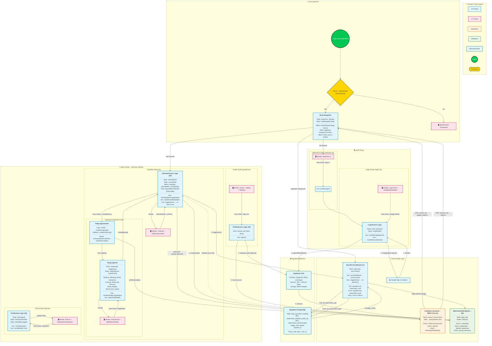

# Tapasi — Project Workflow Diagram

```mermaid
graph TD
    %% --- LEGEND & STYLES ---
    classDef jsThread fill:#e1f5fe,stroke:#0277bd,stroke-width:2px;
    classDef uiThread fill:#fce4ec,stroke:#c2185b,stroke-width:2px;
    classDef store   fill:#fff3e0,stroke:#ef6c00,stroke-width:2px,rx:5,ry:5;
    classDef db      fill:#e8f5e9,stroke:#2e7d32,stroke-width:2px,rx:5,ry:5;
    classDef backend fill:#e0f7fa,stroke:#006064,stroke-width:2px,rx:5,ry:5;
    classDef startPoint fill:#00c853,stroke:#000,stroke-width:3px,color:#fff;
    classDef checkpoint fill:#ffd600,stroke:#000,stroke-width:2px;

    subgraph Legend ["🧵 Thread & Type Legend"]
        L1[JS Thread]:::jsThread
        L2[UI Thread]:::uiThread
        L3[State/Store]:::store
        L4[Database]:::db
        L5[Backend/Cloud]:::backend
        L6((START)):::startPoint
        L7{{Checkpoint}}:::checkpoint
    end

    %% ============================================================
    %% ROOT LAYOUT — App Entry Point
    %% ============================================================
    subgraph RootLayout ["📱 root/_layout.tsx"]
        direction TB
        Init(("🚀 App Launch [[START]]")):::startPoint
        HydrateCheck{"Check: _hasHydrated {{Checkpoint}}"}:::checkpoint

        AuthCheck["<b>Root Navigation</b><hr/>State: segments, isReady<br/>State: rootNavigationState<hr/>Effect: onAuthStateChange listener<br/>Effect: AppState foreground listener<br/>Effect: Check auth & redirect"]:::jsThread

        SplashScreen["🖥️ SplashScreen Component"]:::uiThread

        Init --> HydrateCheck
        HydrateCheck -- "No" --> SplashScreen
        HydrateCheck -- "Yes" --> AuthCheck
    end

    %% ============================================================
    %% AUTH FLOW
    %% ============================================================
    subgraph AuthGroup ["🔒 (auth) Group"]
        direction TB

        subgraph WelcomeScreen ["Welcome Screen (welcome.tsx)"]
            WelcomeUI["🖥️ Render: Welcome UI"]:::uiThread
            HandleLogin("func: handleLogin()"):::jsThread
        end

        subgraph LoginScreen ["Login Screen (login.tsx)"]
            LoginLogic["<b>LoginScreen Logic</b><hr/>State: email, password<br/>State: isLoginMode<hr/>func: handleGoogleSignIn()<br/>func: handleManualSubmit()"]:::jsThread
            LoginUI["🖥️ Render: Login Form + GoogleSigninButton"]:::uiThread
        end
    end

    %% ============================================================
    %% MAIN APP — TABS
    %% ============================================================
    subgraph TabsGroup ["📑 (tabs) Group — BlurView Tab Bar"]
        direction TB

        subgraph CalendarScreen ["Calendar (index.tsx)"]
            CalendarLogic["<b>CalendarScreen Logic (JS)</b><hr/>State: selectedDate<br/>State: currentDate<br/>Memo: logsMap, periodDates, activityDates<br/>Prop: logs (WatermelonDB Observable)<hr/>func: handleUpdateLog(updates)<br/>func: setSelectedDate(date)<br/>func: triggerSync() → on every save"]:::jsThread

            RenderCalendar["🖥️ Render: Calendar + DailyLogContainer"]:::uiThread

            subgraph DailyLogComponents ["DailyLog Component Chain"]
                DailyLogContainer["<b>DailyLogContainer</b><hr/>Logic: model → modelToLogType()<br/>Fallback: createEmptyLog()<hr/>Wraps: EnhancedObservedForm (withObservables)"]:::jsThread
                DailyLogForm["<b>DailyLogForm</b><hr/>State: sleepInput, weightInput<br/>State: visibleOptions, modalConfig<hr/>Sections: Bleeding, Mood, Symptoms,<br/>Cravings, WorkLoad, Exercise,<br/>Sleep, Weight, BirthControl, Habits<hr/>func: handleUpdateLog(updates)<br/>func: openFilterModal()"]:::jsThread
                RenderForm["🖥️ Render: ActivityCard + EditOptionsModal"]:::uiThread
            end
        end

        subgraph ChatScreen ["Chat Screen (chat.tsx)"]
            ChatLogic["<b>ChatScreen Logic (JS)</b><hr/>State: messages[]<br/>State: isKeyboardVisible<br/>State: editingMessageId<hr/>func: sendMessage()<br/>func: handleEdit(id, text)"]:::jsThread
            RenderChat["🖥️ Render: FlatList + KeyboardAvoidingView"]:::uiThread
        end

        subgraph ProfileScreen ["Profile Screen (profile.tsx)"]
            ProfileLogic["<b>ProfileScreen Logic (JS)</b><hr/>Data: session.user (from Store)<hr/>func: logout()"]:::jsThread
            RenderProfile["🖥️ Render: Avatar + Details + Settings"]:::uiThread
        end
    end

    %% ============================================================
    %% DATA & STATE LAYER
    %% ============================================================
    subgraph DataLayer ["💾 Data & State Layer"]
        AuthStore["<b>AuthStore (Zustand + MMKV Persist)</b><hr/>State: session: Session|null<br/>State: _hasHydrated: bool<hr/>Action: setSession(session)<br/>Action: logout()<br/>Action: setHasHydrated(bool)"]:::store

        WMDB["<b>WatermelonDB (SQLite + JSI)</b><hr/>Table: daily_logs<br/>Model: DailyLog<hr/>Action: create(log)<br/>Action: update(log) → @writer updateLog<br/>Action: query().observe()"]:::db

        SyncService["<b>SyncService (db/sync.ts)</b><hr/>State: isSyncing, syncTimeout<hr/>func: syncDatabase() → synchronize()<br/>func: triggerSync() → 2s debounce<hr/>Pull: supabase.rpc watermelon_pull<br/>Push: supabase.rpc watermelon_push<br/>Retry: once on failure"]:::jsThread

        GoogleSignIn["☁️ Google Sign-In (Native)"]:::jsThread
    end

    %% ============================================================
    %% BACKEND / CLOUD LAYER
    %% ============================================================
    subgraph BackendLayer ["☁️ Supabase Backend"]
        SupabaseAuth["<b>Supabase Auth</b><hr/>Provider: Google (ID Token exchange)<br/>Session: JWT + Refresh Token<br/>Storage: MMKV Adapter"]:::backend

        SupabaseDB["<b>Supabase PostgreSQL</b><hr/>Table: daily_logs (RLS enabled)<br/>RPC: watermelon_pull(last_pulled_at)<br/>RPC: watermelon_push(changes)<br/>Trigger: auto-update updated_at<hr/>Policy: auth.uid() = user_id"]:::backend
    end

    %% ============================================================
    %% TRANSITIONS — Auth Flow
    %% ============================================================
    AuthCheck -- "No Session" --> WelcomeUI
    AuthCheck -- "Has Session" --> CalendarLogic

    WelcomeUI -- "User Action: Sign In" --> HandleLogin
    HandleLogin --> LoginLogic

    LoginUI -- "User Action: Google Button" --> LoginLogic
    LoginLogic -- "1. GoogleSignin.signIn()" --> GoogleSignIn
    GoogleSignIn -- "2. idToken" --> LoginLogic
    LoginLogic -- "3. signInWithIdToken()" --> SupabaseAuth
    SupabaseAuth -- "4. Session" --> AuthStore
    AuthStore -- "UPD: session set → triggers redirect" --> AuthCheck

    %% ============================================================
    %% TRANSITIONS — Calendar & Daily Log
    %% ============================================================
    CalendarLogic -- "Subscribe: query().observe()" --> WMDB
    WMDB -.->|"Updates prop: logs"| CalendarLogic
    RenderCalendar -- "onDateSelect / onPress" --> CalendarLogic
    CalendarLogic -- "Render" --> RenderCalendar

    CalendarLogic -- "Pass model + onUpdateLog" --> DailyLogContainer
    DailyLogContainer -- "withObservables" --> WMDB
    DailyLogContainer -- "Pass logData" --> DailyLogForm
    DailyLogForm -- "Render" --> RenderForm
    RenderForm -- "User Action: toggle/input" --> DailyLogForm
    DailyLogForm -- "onUpdateLog()" --> CalendarLogic
    CalendarLogic -- "1. create/update" --> WMDB
    CalendarLogic -- "2. triggerSync()" --> SyncService

    %% ============================================================
    %% TRANSITIONS — Sync Flow
    %% ============================================================
    SyncService -- "Pull: rpc watermelon_pull" --> SupabaseDB
    SupabaseDB -- "Changes JSON" --> SyncService
    SyncService -- "Apply pulled changes" --> WMDB
    SyncService -- "Push: rpc watermelon_push" --> SupabaseDB

    AuthCheck -- "AppState: foreground" --> SyncService

    %% ============================================================
    %% TRANSITIONS — Chat
    %% ============================================================
    RenderChat -- "User Action: type/send" --> ChatLogic
    ChatLogic -- "Update State" --> RenderChat

    %% ============================================================
    %% TRANSITIONS — Profile & Logout
    %% ============================================================
    RenderProfile -- "User Action: Sign Out" --> ProfileLogic
    ProfileLogic -- "1. supabase.auth.signOut()" --> SupabaseAuth
    ProfileLogic -- "2. Clear session" --> AuthStore
    AuthStore -- "UPD: session=null → redirect" --> AuthCheck

    class RootLayout,AuthGroup,TabsGroup,WelcomeScreen,LoginScreen,CalendarScreen,ChatScreen,ProfileScreen,DailyLogComponents screen;
```
